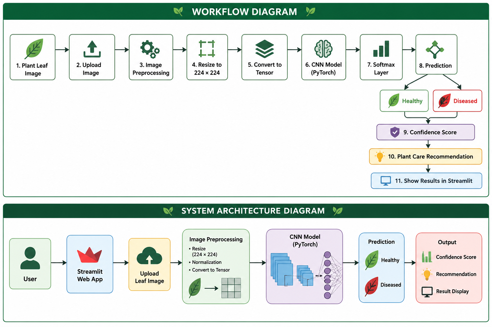

# 🌿 Plant Disease Detection using CNN

An AI-powered web application that detects whether a plant leaf is **Healthy** or **Diseased** using a Convolutional Neural Network (CNN) built with **PyTorch** and deployed using **Streamlit**.

---

# 📷 Project Screenshot



---

# 🚀 Features

- 🌿 Detect Healthy and Diseased Plant Leaves
- 🤖 Deep Learning using CNN
- 📤 Upload Plant Leaf Images
- 📊 Confidence Score
- 📈 Prediction Probability
- 💡 Plant Care Recommendations
- 🌐 Streamlit Web Application
- 🎨 Professional User Interface

---

# 🔄 Workflow Diagram

```text
Plant Leaf Image
        │
        ▼
 Upload Image
        │
        ▼
 Image Preprocessing
        │
        ▼
 Resize (224×224)
        │
        ▼
 Convert to Tensor
        │
        ▼
 CNN Model (PyTorch)
        │
        ▼
 Softmax Layer
        │
        ▼
 Prediction
   ┌─────────────┐
   │             │
Healthy     Diseased
   │             │
   └──────┬──────┘
          ▼
 Confidence Score
          │
          ▼
 Recommendation
          │
          ▼
 Streamlit Interface
```

---

# 🏗️ System Architecture

```text
           User
             │
             ▼
      Streamlit Web App
             │
             ▼
      Upload Leaf Image
             │
             ▼
    Image Preprocessing
             │
             ▼
      CNN Model (PyTorch)
             │
             ▼
     Healthy / Diseased
             │
             ▼
     Confidence Score
             │
             ▼
    Plant Recommendation
```

---

# 📂 Project Structure

```text
Plant_Disease_Detection/
│
├── assets/
│   └── logo.png
│
├── screenshots/
│   └── home.png
│
├── dataset/
│   ├── train/
│   ├── valid/
│   └── test/
│
├── app.py
├── model.py
├── train.py
├── predict.py
├── requirements.txt
├── README.md
└── plant_disease_model.pth
```

---

# 🛠 Technologies Used

- Python
- PyTorch
- Torchvision
- Streamlit
- Pillow (PIL)

---

# ⚙️ Installation

Clone the repository:

```bash
git clone https://github.com/mohammadthoufeeq12190-design/Plant_Disease_Detection.git
```

Go to the project folder:

```bash
cd Plant_Disease_Detection
```

Install dependencies:

```bash
pip install -r requirements.txt
```

Run the application:

```bash
python -m streamlit run app.py
```

---

# 📊 Model Output

The application predicts:

- 🌿 Healthy
- 🍂 Diseased

It also displays:

- Confidence Score
- Prediction Probability
- Plant Care Recommendation

---

# 📌 Future Improvements

- Support multiple plant diseases
- Train on the full PlantVillage dataset
- Deploy online
- Download prediction reports
- Prediction history
- Mobile-friendly interface

---

# 👨‍💻 Developer

**Mohammad Thoufeeq**

Built using **Python, PyTorch, CNN, and Streamlit**.

If you like this project, ⭐ star the repository on GitHub!

## 🌐 Live Demo

🚀 **Try the application here:**

https://plantdiseasedetection-zr3aznm7rraaaab59bpvbx.streamlit.app/